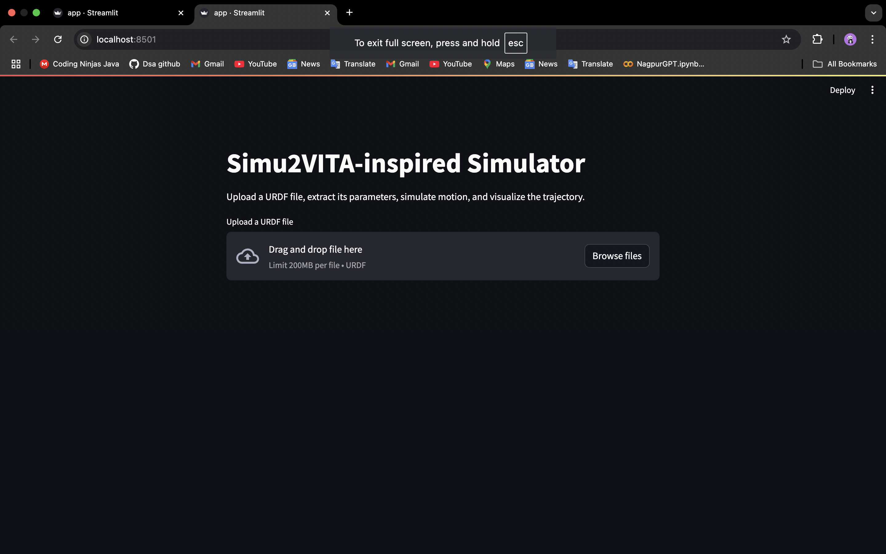
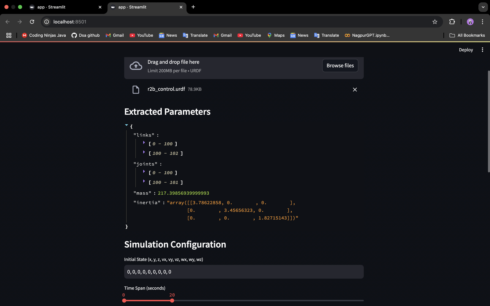
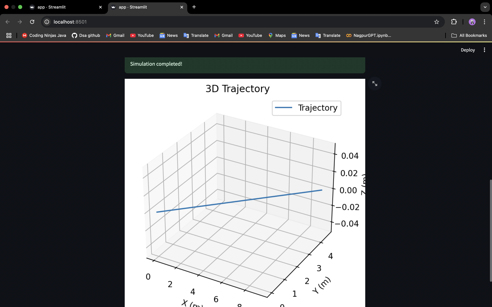

# Simu2VITA-inspired Simulator

## Overview
The **Simu2VITA-inspired Simulator** is a Streamlit-based application that allows users to:

1. **Upload URDF Files**: Parse and extract parameters from a robot's URDF (Unified Robot Description Format) file.
2. **Simulate Dynamics**: Simulate the vehicle's motion based on the extracted parameters and user-configured initial conditions.
3. **Visualize Trajectories**: Visualize the simulated 3D trajectory of the vehicle.

## Features
- **URDF Parsing**: Converts URDF files into a JSON-like structure and extracts critical parameters such as links, joints, mass, and inertia.
- **Customizable Simulation**: Users can specify initial conditions (position, velocity, and angular velocity) and simulation duration.
- **3D Trajectory Visualization**: Plots the simulated trajectory in a 3D space using Matplotlib.
- **Interactive UI**: Built with Streamlit for an easy-to-use interface.

## Images

### 1. Web Interface Overview

### 2. URDF Parser Function

### 3. 3D Trajectory Visualization

## Installation
### Prerequisites
- Python 3.7 or higher
- pip (Python package installer)

## How It Works
### URDF Parsing
The URDF file is parsed using Python's `xml.etree.ElementTree` module. The structure and attributes of links, joints, and inertial properties are extracted and stored in a JSON-like format.

### Vehicle Dynamics
The dynamics are simulated using the `scipy.integrate.solve_ivp` method with:
- **Drag Force**: Proportional to the vehicle's velocity.
- **Thrust Force**: Configurable constant thrust.
- **Torque**: Proportional to angular velocity.

### Visualization
The `matplotlib` library is used to generate a 3D trajectory plot of the vehicle's motion over the simulation period.

## Configuration
### Input Fields
- **URDF File**: Upload a `.urdf` file containing the robot description.
- **Initial State**: Set the initial position, velocity, and angular velocity as a comma-separated list (e.g., `0, 0, 0, 0, 0, 0, 0, 0, 0`).
- **Time Span**: Select the start and end times for the simulation.

### Parameters
The simulation uses default coefficients for drag and torque, which can be modified in the `simulate()` function:
- Drag Coefficient: `[0.1, 0.1, 0.2]`
- Torque Coefficient: `[0.05, 0.05, 0.05]`
- Thrust: `[10.0, 5.0, 0.0]`

## Technologies Used
- **Streamlit**: User interface
- **XML Parsing**: `xml.etree.ElementTree` for URDF processing
- **Scientific Computing**: `numpy` and `scipy` for numerical calculations
- **Visualization**: `matplotlib` for trajectory plotting

## Future Enhancements
- Allow dynamic adjustment of drag, torque, and thrust coefficients through the UI.
- Support for exporting simulation results in JSON or CSV format.
- Add validation for URDF file structure and content.
- Expand visualization capabilities with additional plots (e.g., velocity vs. time).

## License
This project is licensed under the MIT License. See the LICENSE file for more details.

## Acknowledgments
This simulator was inspired by **Simu2VITA** and aims to provide an interactive and accessible platform for vehicle dynamics simulation.

